<h1>Autenticaçãp com Google OAuth e React</h1>

<h2>Google Cloud Platform</h2>
<i>Visto que a plataforma é meio confusa de se utilizar acho interessante criar um mini tutorial dela para obtermos o ID do Google para usarmos a API</i>
 
 
Criando novo projeto precisamos indicar o nome.
 

    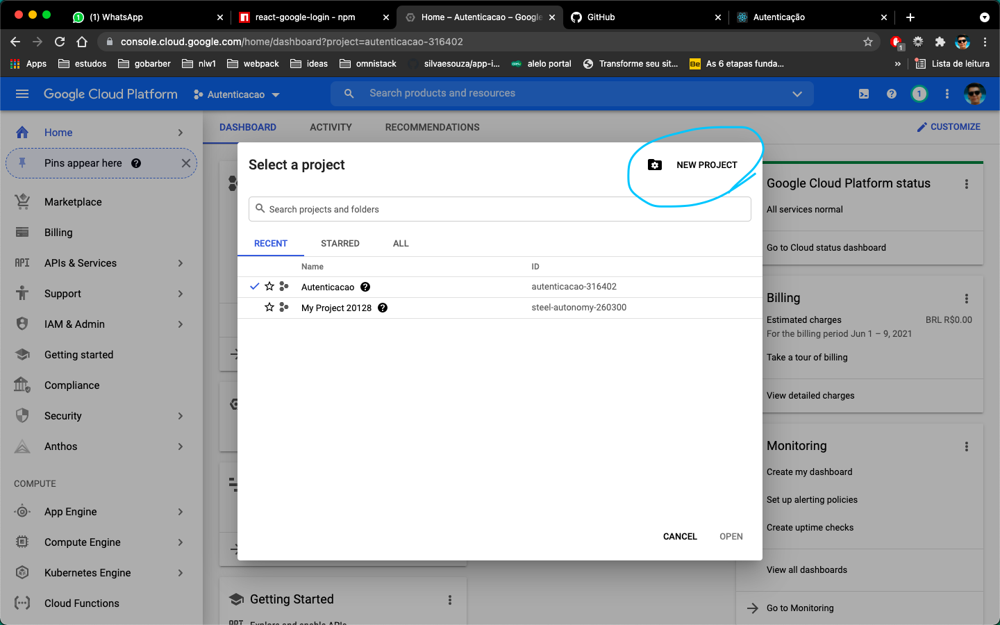
    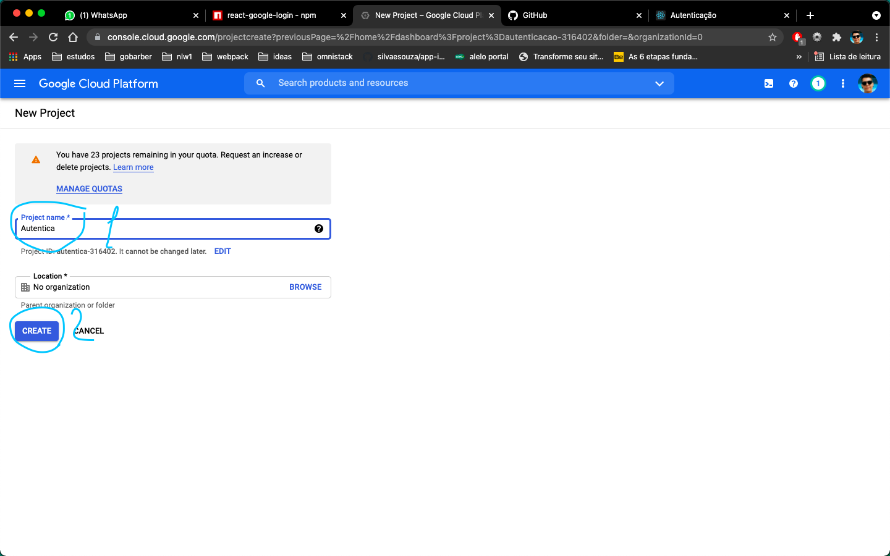

 
 
Agora devemos selecionar o nosso projeto criado
 

    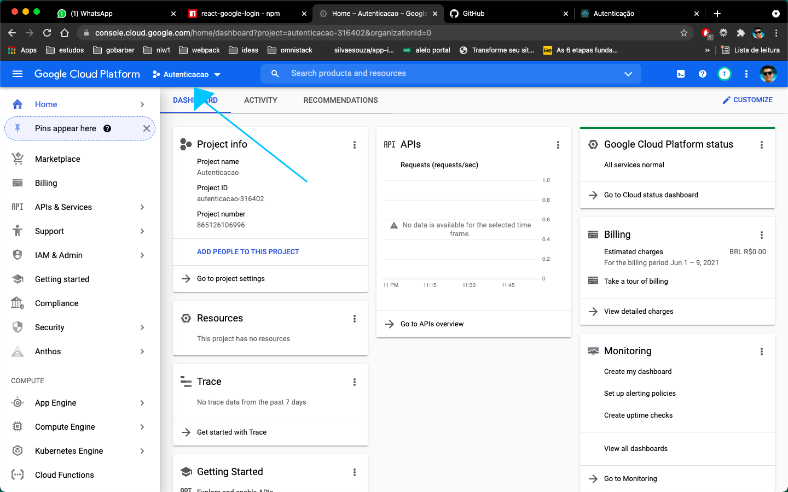
    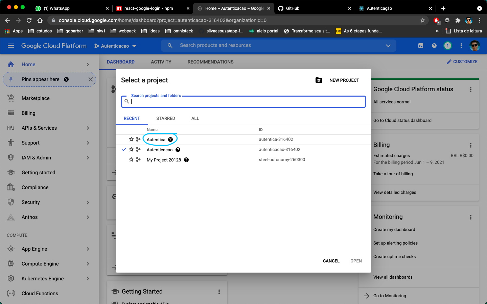

 
 
Voltamos para o menu esquerdo e clicamos em credenciais. Nessa página temos que clicar na sessão que diz para configurarmos o OAuth. Na próxima página devemos selecionar o tipo de usuario como externo que indica que qualquer usuário possa logar.
 

    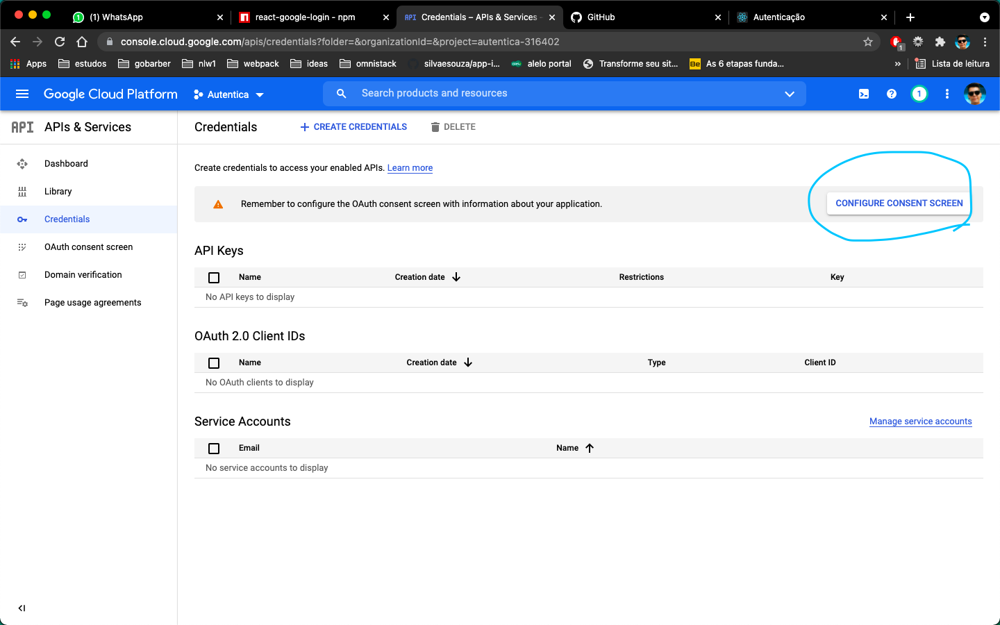
    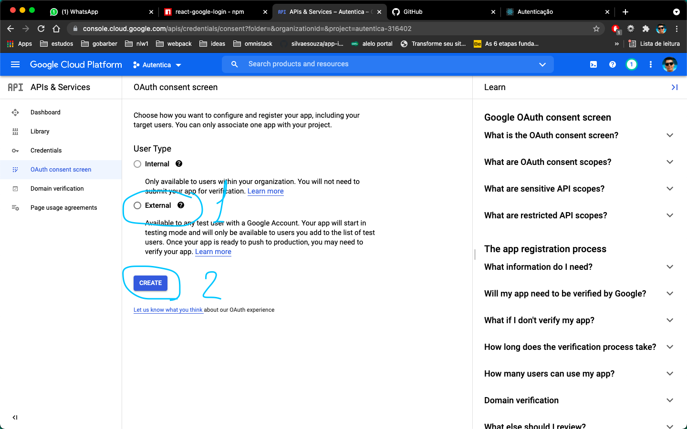

 
 
Posteriormente temos que adicionar informações a respeito da nossa aplicação como nome, email de suporte e email de contato. Os outros campos não precisam ser alterados. Sendo assim, é só confirmar as outras telas até sermos redirecionados para o dashboard.
 

    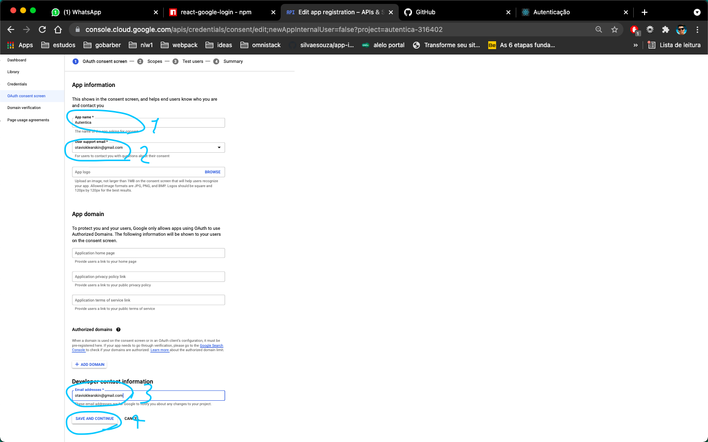

 
 
Já no dashboard, devemos selecionar no menu esquerdo à sessão de credenciais. Ao entrarmos nela clicamos no botão criar credenciais e selecionamos OAuth client ID.
 

    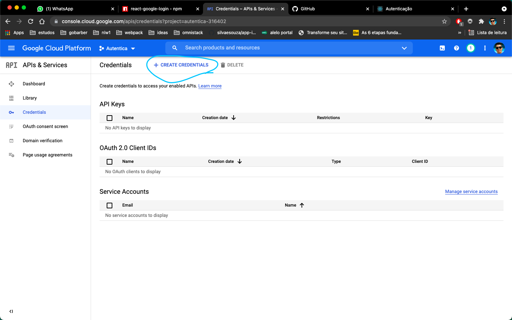
    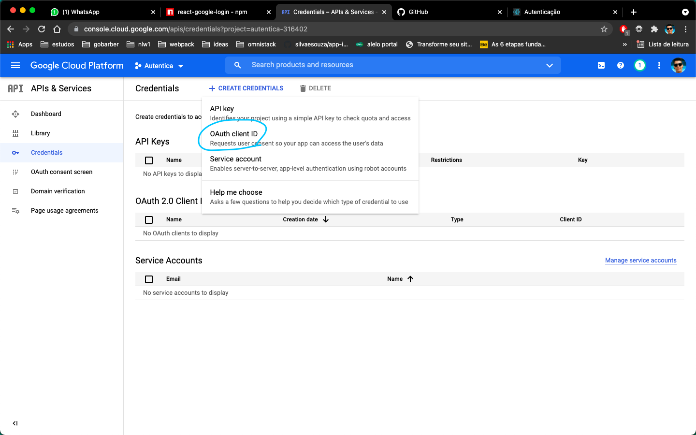

 
 
Após isso, temos criar nosso client id. Para isso, selecionamos o tipo da aplicação, seu nome, e a uri do seu site, no caso se estiver rodando localmente, utilizar a porta em que a aplicação está sendo servida (react normalmente roda na porta 3000)
 

    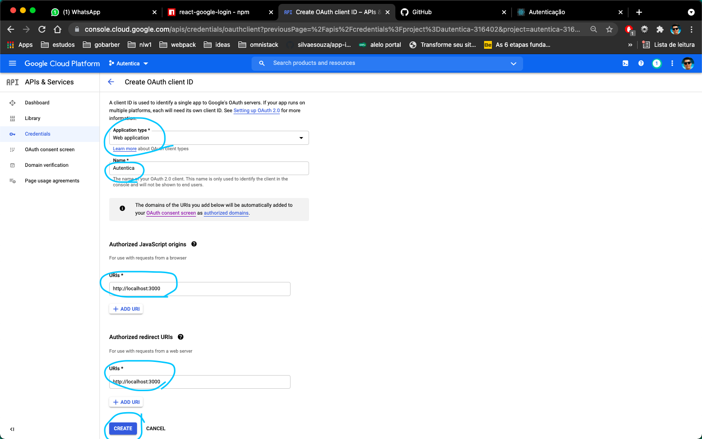

 
 
Voltamos à sessão de credenciais e selecionamos nosso projeto. Ao clicar nele, nos é obtido o ID do cliente.
 

    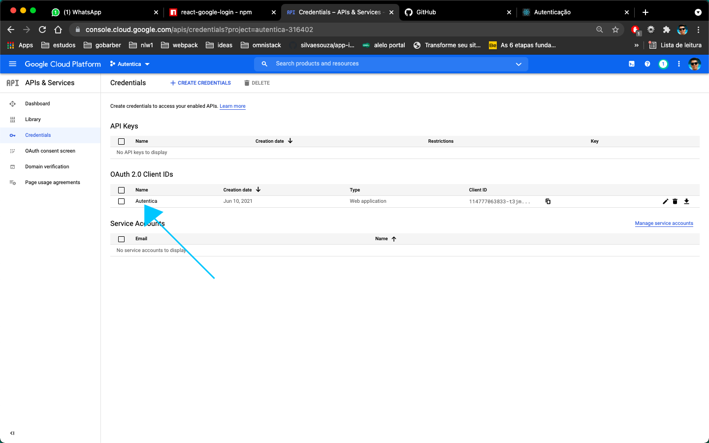
    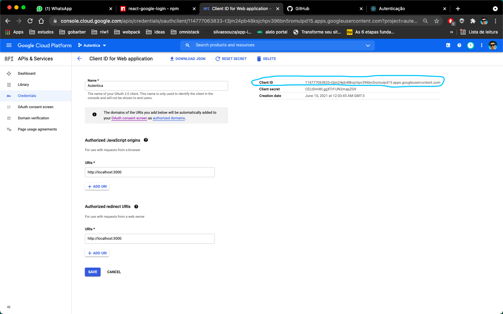

 
 
Agora é só utilizar esse id no componente que a biblioteca nos fornece e ter acesso à API do Google para obter as informações dos usuários.
 

<a href="https://github.com/anthonyjgrove/react-google-login">React Google login</a> 

